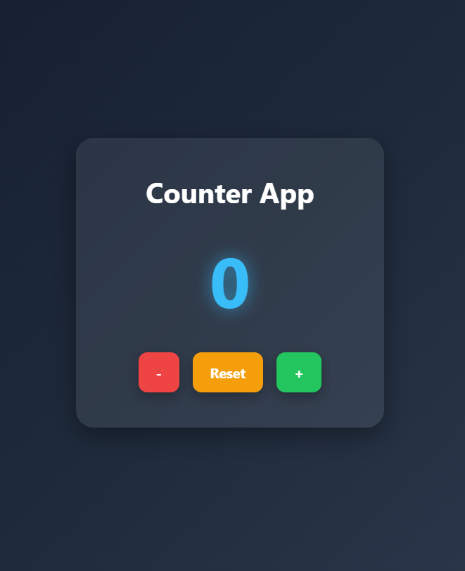

# 🔢 Counter App

A simple and responsive **Counter App** built using **HTML, CSS, and JavaScript**. This project is part of my **20 Days of Web Development Challenge**.

## ✨ Features

* ➕ Increase the counter value
* ➖ Decrease the counter value
* 🔄 Reset the counter to zero
* 📱 Responsive design
* 🎨 Modern UI with attractive colors and shadows

## 🛠️ Technologies Used

* HTML5
* CSS3
* JavaScript

## 📂 Project Structure

```text
Counter-App/
│
├── index.html
├── style.css
├── script.js
└── README.md
```
## 📸 Preview

**

## 📚 What I Learned

* HTML page structure
* CSS styling and layout
* JavaScript variables
* DOM manipulation
* Event handling with buttons

## 🌟 Future Improvements

* Dark/Light mode
* Save count using Local Storage
* Animated counter transitions
* Sound effects on button clicks

---

**Day 01 – 20 Days of Web Development Challenge 🚀**
