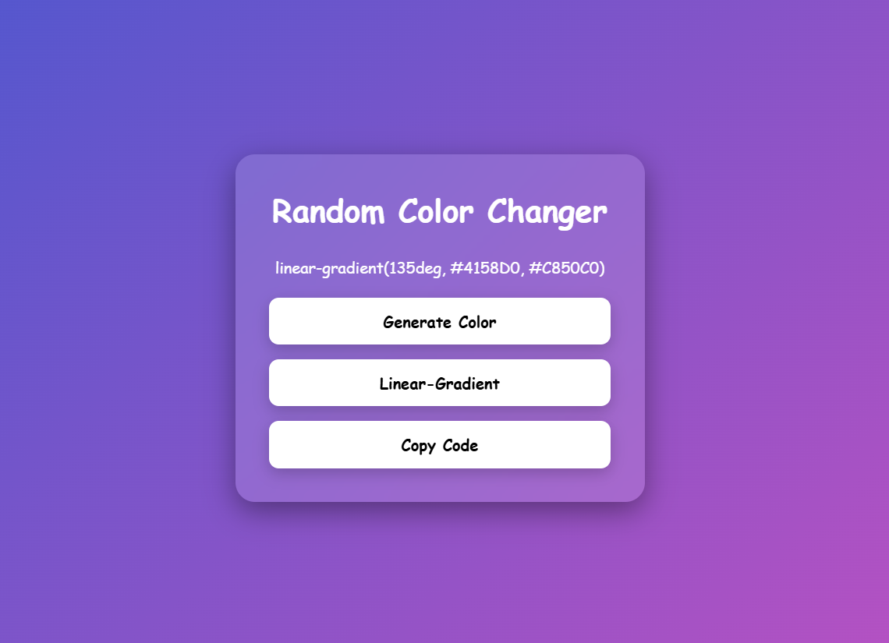

# 🎨 Random Color Changer

A simple and interactive **Random Color Changer** built using **HTML, CSS, and JavaScript**. This project allows users to generate random solid colors or random linear gradients with a single click and copy the generated CSS code to the clipboard.

## 🚀 Features

* 🎨 Generate random solid colors
* 🌈 Generate random linear gradients
* 📐 Random gradient angles (0°–360°)
* 📋 Copy generated color/gradient code with one click
* ✨ Modern glassmorphism UI
* 💻 Beginner-friendly and responsive design

## 🛠️ Technologies Used

* HTML5
* CSS3
* JavaScript (ES6)

## 📂 Project Structure

```text
Random-Color-Changer/
│
├── index.html
├── style.css
├── script.js
└── README.md
```

## ✨ Buttons

* **Generate Color** → Creates a random HEX color.
* **Linear-Gradient** → Creates a random linear gradient with two random colors and a random angle.
* **Copy Code** → Copies the generated CSS code to your clipboard.

## 📸 Preview

**

## 📚 Concepts Practiced

* DOM Manipulation
* Event Listeners
* Functions in JavaScript
* Random Number Generation
* Dynamic CSS Styling
* Template Literals
* Clipboard API

## 🔮 Future Improvements

* 🎨 Add RGB and HSL color generation
* ❤️ Save favorite colors and gradients
* 📜 Gradient history
* 🌙 Dark/Light mode
* 📱 Improved mobile responsiveness
* 🖼️ Download gradient as an image

## 🌐 Live Demo
https://day-02-color-changer.netlify.app/

---

### 🚀 Day 02 – 20 Days of Web Development Challenge

Building one project every day using **HTML, CSS, and JavaScript** to improve my frontend development skills and create a strong portfolio.
