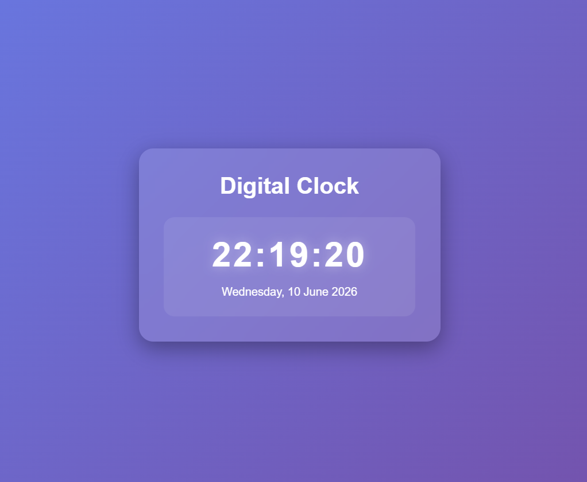

# 🕒 Digital Clock

A simple and elegant **Digital Clock** built using **HTML, CSS, and JavaScript**. This project displays the current time in real-time using the **Date Object** and updates every second with the help of `setInterval()` and DOM manipulation.

## 🚀 Features

* 🕒 Live digital clock
* ⏱️ Updates every second automatically
* 📅 Uses JavaScript `Date` Object
* 🔄 Real-time DOM updates
* 🎨 Modern and responsive UI
* ⚡ Smooth and lightweight performance

## 🛠️ Technologies Used

* HTML5
* CSS3
* JavaScript (ES6)

## 📂 Project Structure

```text
Digital-Clock/
│
├── index.html
├── style.css
├── script.js
└── README.md
```

## 📸 Preview

**

## 📚 Concepts Practiced

* JavaScript Date Object
* `setInterval()` Function
* DOM Manipulation
* Real-Time Updates
* String Formatting
* Event Loop Basics

## 🔮 Future Improvements

* 📅 Show current date and day
* 🌙 Dark/Light mode toggle
* 🌍 Multiple timezone clocks
* ⏰ Alarm feature
* ⌚ 12-hour / 24-hour format switch
* 🎨 Theme customization

## 🌐 Live Demo
https://day-03-digital-clock.netlify.app

---

### 🚀 Day 03 – 20 Days of Web Development Challenge

Building one project every day using **HTML, CSS, and JavaScript** to improve my frontend development skills and create a strong portfolio.

