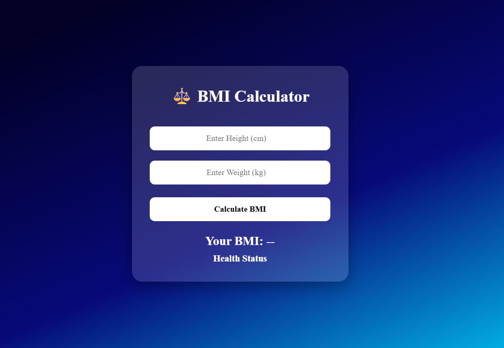

# ⚖️ BMI Calculator

A simple and responsive **BMI (Body Mass Index) Calculator** built using **HTML, CSS, and JavaScript**. This project calculates BMI based on the user's height and weight and displays the corresponding health category instantly.

## 🚀 Features

* 📏 Enter height and weight using input fields
* ⚡ Instant BMI calculation
* 🩺 Displays BMI category (Underweight, Normal, Overweight, Obese)
* 📝 Input validation for empty fields
* 🎨 Modern and responsive UI
* 💻 Beginner-friendly project

## 🌐 Live Demo

**🔗 Live Website:** https://day-04-bmi-calculator.netlify.app

## 🛠️ Technologies Used

* HTML5
* CSS3
* JavaScript (ES6)

## 📂 Project Structure

```text
BMI-Calculator/
│
├── index.html
├── style.css
├── script.js
└── README.md
```

## 📸 Preview

**

## 📚 Concepts Practiced

* HTML Forms
* Input Fields
* JavaScript Conditions (`if`, `else if`, `else`)
* DOM Manipulation
* Event Handling
* Mathematical Calculations
* Input Validation

## 🔮 Future Improvements

* 📊 BMI chart visualization
* 🎯 Healthy weight range calculator
* 💾 Save BMI history using Local Storage
* 🌙 Dark/Light mode
* 📱 Improved mobile responsiveness
* 🎨 Animated result display

---

### 🚀 Day 04 – 20 Days of Web Development Challenge

Building one project every day using **HTML, CSS, and JavaScript** to improve my frontend development skills and create a strong portfolio.

