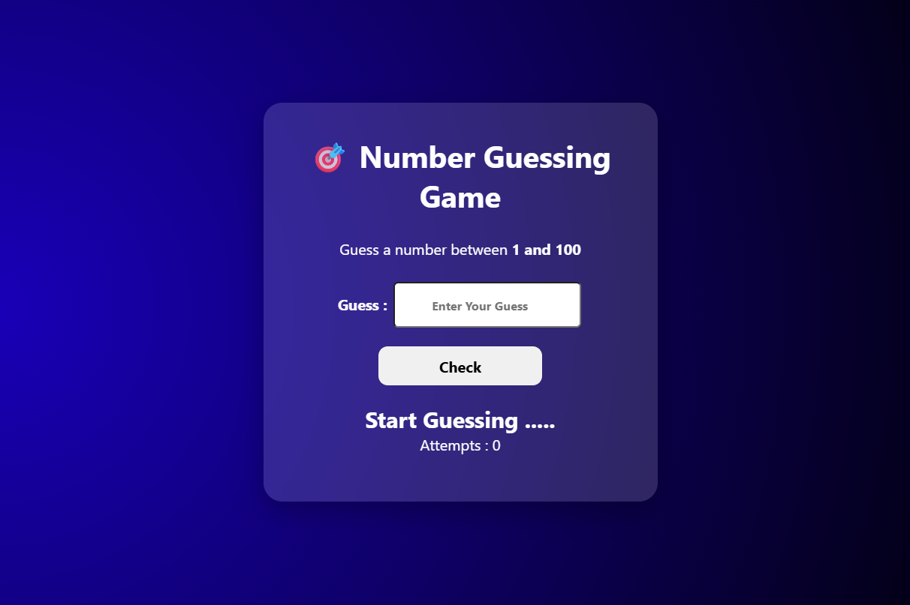

# 🎯 Number Guessing Game

A fun and interactive **Number Guessing Game** built using **HTML, CSS, and JavaScript**. The game generates a random number between **1 and 100**, and the player has to guess it with the help of hints until the correct number is found.

## 🚀 Features

* 🎲 Random number generation between **1 and 100**
* 📈 Displays **Too High** or **Too Low** hints
* 🎉 Shows a success message when the correct number is guessed
* 🔢 Tracks the total number of attempts
* 📝 Input validation for empty fields
* 🎨 Modern and responsive UI

## 🌐 Live Demo

**🔗 Live Website:** https://day-06-number-guessing-game.vercel.app/

## 🛠️ Technologies Used

* HTML5
* CSS3
* JavaScript (ES6)

## 📂 Project Structure

```text
Number-Guessing-Game/
│
├── index.html
├── style.css
├── script.js
└── README.md
```

## 📸 Preview

**

## 📚 Concepts Practiced

* JavaScript Random Number Generation
* `Math.random()` and `Math.floor()`
* Conditional Statements (`if`, `else if`, `else`)
* Event Listeners
* DOM Manipulation
* Variables and Input Handling
* Attempt Counter Logic

## 🔮 Future Improvements

* 🔄 Restart Game button
* 🎯 Difficulty levels (Easy, Medium, Hard)
* ⏳ Countdown timer
* 🏆 High score system
* 🎵 Sound effects and animations
* 💾 Save best score using Local Storage

---

### 🚀 Day 06 – 20 Days of Web Development Challenge

Building one project every day using **HTML, CSS, and JavaScript** to improve my frontend development skills and create a strong portfolio.

