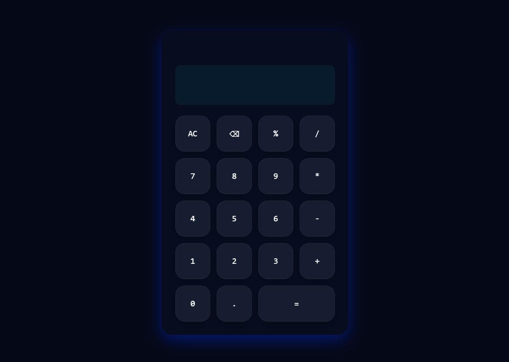

# 🧮 Simple Calculator

A modern and responsive **Simple Calculator** built using **HTML, CSS, and JavaScript**. This project performs basic arithmetic operations with a sleek     -inspired UI, animated buttons, and dynamic DOM updates.

## 🚀 Features

* ➕ Addition
* ➖ Subtraction
* ✖️ Multiplication
* ➗ Division
* 📊 Modulus (`%`) operation
* 🗑️ All Clear (`AC`) button
* ⌫ Backspace/Delete functionality
* ⚡ Instant calculation
* 🎨 Modern cyber-style glassmorphism UI
* ✨ Animated hover light effect on buttons
* 📱 Responsive design

## 🌐 Live Demo

**🔗 Live Website:** https://day-07-simple-calculator.vercel.app

## 🛠️ Technologies Used

* HTML5
* CSS3
* JavaScript (ES6)

## 📂 Project Structure

```text
Simple-Calculator/
│
├── index.html
├── style.css
├── script.js
└── README.md
```

## 📸 Preview

**

## 📚 Concepts Practiced

* JavaScript Functions
* DOM Manipulation
* Arithmetic Operators
* Event Handling
* String Manipulation
* `eval()` Function
* Input Validation
* CSS Grid Layout
* Glassmorphism UI Design
* CSS Hover Animations

## 🔮 Future Improvements

* ⌨️ Keyboard support
* 📜 Calculation history
* 🌙 Dark/Light mode toggle
* 🧮 Scientific calculator mode
* 🎨 Multiple color themes
* 💾 Save history using Local Storage

---

### 🚀 Day 07 – 20 Days of JavaScript Projects Challenge

Building one project every day using **HTML, CSS, and JavaScript** to improve my frontend development skills and create a strong portfolio.

⭐ If you like this project, don't forget to star the repository!
