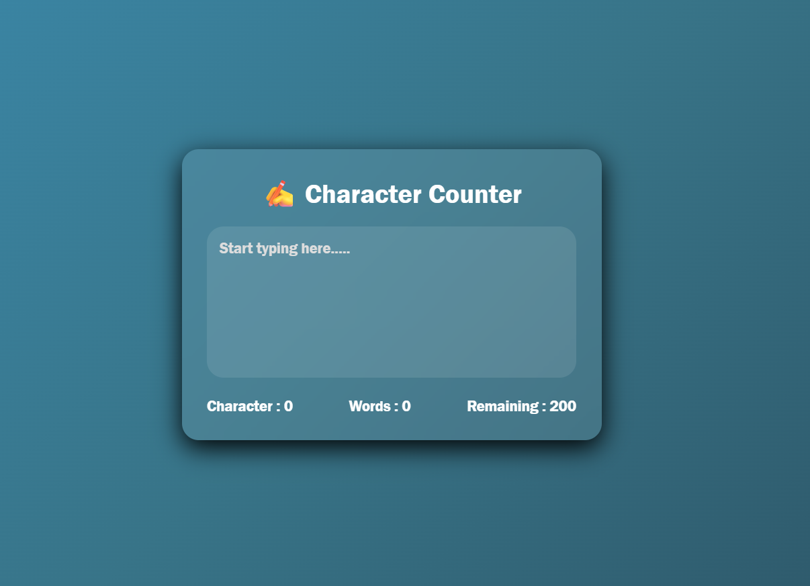

# ✍️ Character Counter

A simple and interactive **Character Counter** built using **HTML, CSS, and JavaScript**. This project counts the number of **characters**, **words**, and **remaining characters** in real time as the user types, making it a great practice project for JavaScript string manipulation and DOM updates.

## 🚀 Features

* ✍️ Live character counting
* 📝 Live word counting
* 📏 Remaining character counter
* ⚡ Real-time updates while typing
* 🎨 Modern glassmorphism UI
* 📱 Responsive design
* 💻 Beginner-friendly project

## 🌐 Live Demo

**🔗 Live Website:** https://day-08-character-counter.vercel.app/

## 🛠️ Technologies Used

* HTML5
* CSS3
* JavaScript (ES6)

## 📂 Project Structure

```text
Character-Counter/
│
├── index.html
├── style.css
├── script.js
└── README.md
```

## 📸 Preview

**

## 📚 Concepts Practiced

* JavaScript Strings
* Input Events (`input`)
* Text Handling
* DOM Manipulation
* Event Listeners
* String Methods
* Real-Time UI Updates

## 🔮 Future Improvements

* 🔤 Character limit warning
* 📄 Sentence and paragraph counter
* ⏱️ Reading time estimation
* 💾 Auto-save text using Local Storage
* 🌙 Dark/Light mode toggle
* 📱 Enhanced mobile responsiveness

---

### 🚀 Day 08 – 20 Days of JavaScript Projects Challenge

Building one project every day using **HTML, CSS, and JavaScript** to improve my frontend development skills and create a strong portfolio.
