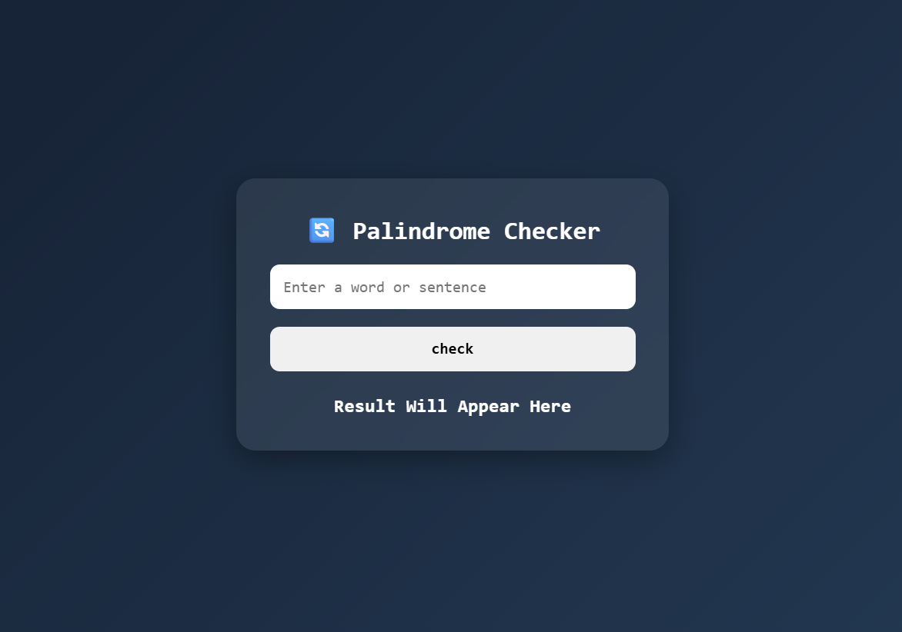

# 🔄 Palindrome Checker

A simple and interactive **Palindrome Checker** built using **HTML, CSS, and JavaScript**. This project checks whether a given word or sentence is a palindrome by comparing the original text with its reversed version while ignoring spaces, special characters, and letter case.

## 🚀 Features

* 🔄 Check if a word or sentence is a palindrome
* 🔠 Case-insensitive comparison
* 📝 Ignores spaces and special characters
* ⚡ Instant result on button click
* 🎨 Modern and responsive UI
* 💻 Beginner-friendly project

## 🌐 Live Demo

**🔗 Live Website:** https://day-09-palindrome-checker.vercel.app/

## 🛠️ Technologies Used

* HTML5
* CSS3
* JavaScript (ES6)

## 📂 Project Structure

```text
Palindrome-Checker/
│
├── index.html
├── style.css
├── script.js
└── README.md
```

## 📸 Preview

**

## 📚 Concepts Practiced

* JavaScript Strings
* String Methods
* Functions
* Logic Building
* Conditional Statements
* DOM Manipulation
* Event Listeners

## 🔮 Future Improvements

* 📜 Check multiple words at once
* 🎤 Voice input support
* 🌙 Dark/Light mode toggle
* ✨ Animated result display
* 📱 Enhanced mobile responsiveness
* 💾 Save previous checks using Local Storage

---

### 🚀 Day 09 – 20 Days of JavaScript Projects Challenge

Building one project every day using **HTML, CSS, and JavaScript** to improve my frontend development skills and create a strong portfolio.
