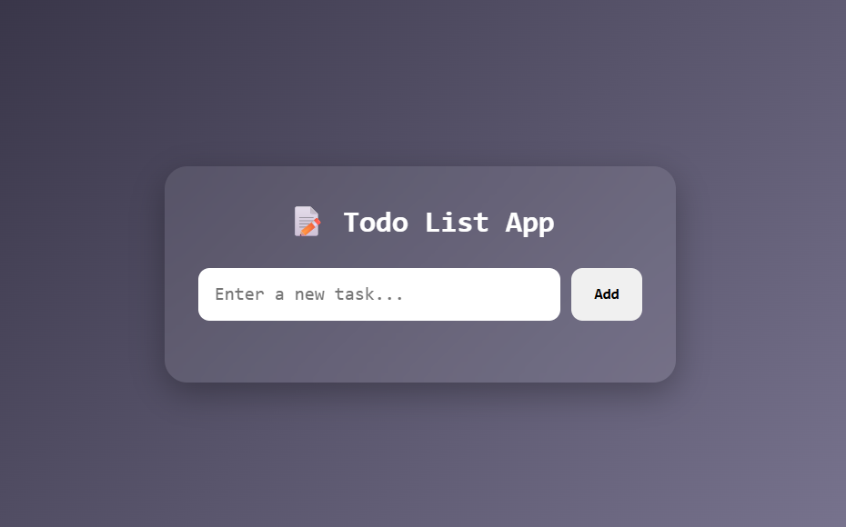

# 📝 Todo List App

A simple and interactive **Todo List App** built using **HTML, CSS, and JavaScript**. This project allows users to add and delete tasks dynamically, making it a great beginner-friendly project for learning **Arrays, DOM Rendering, and CRUD Basics**.

## 🚀 Features

* ➕ Add new tasks
* 🗑️ Delete tasks instantly
* 📋 Dynamic task rendering
* ⚡ Real-time UI updates
* 🎨 Modern and responsive UI
* 💻 Beginner-friendly project

## 🌐 Live Demo

**🔗 Live Website:** https://day-10-todo-list-app.vercel.app/

## 🛠️ Technologies Used

* HTML5
* CSS3
* JavaScript (ES6)

## 📂 Project Structure

```text
Day-10-Todo-List-App
│
├── index.html
├── style.css
├── script.js
└── README.md
```

## 📸 Preview



## 📚 Concepts Practiced

* JavaScript Arrays
* DOM Rendering
* CRUD Basics (Create, Read, Delete)
* DOM Manipulation
* Event Listeners
* Array Methods (`push()`, `splice()`, `forEach()`)
* Dynamic UI Updates

## 🔮 Future Improvements

* ✏️ Edit existing tasks
* ✅ Mark tasks as completed
* 💾 Save tasks using Local Storage
* 🔍 Search and filter tasks
* 🌙 Dark/Light mode toggle
* 📱 Enhanced mobile responsiveness

---

### 🚀 Day 10 – 20 Days of JavaScript Projects Challenge

Building one project every day using **HTML, CSS, and JavaScript** to improve my frontend development skills and create a strong portfolio.
