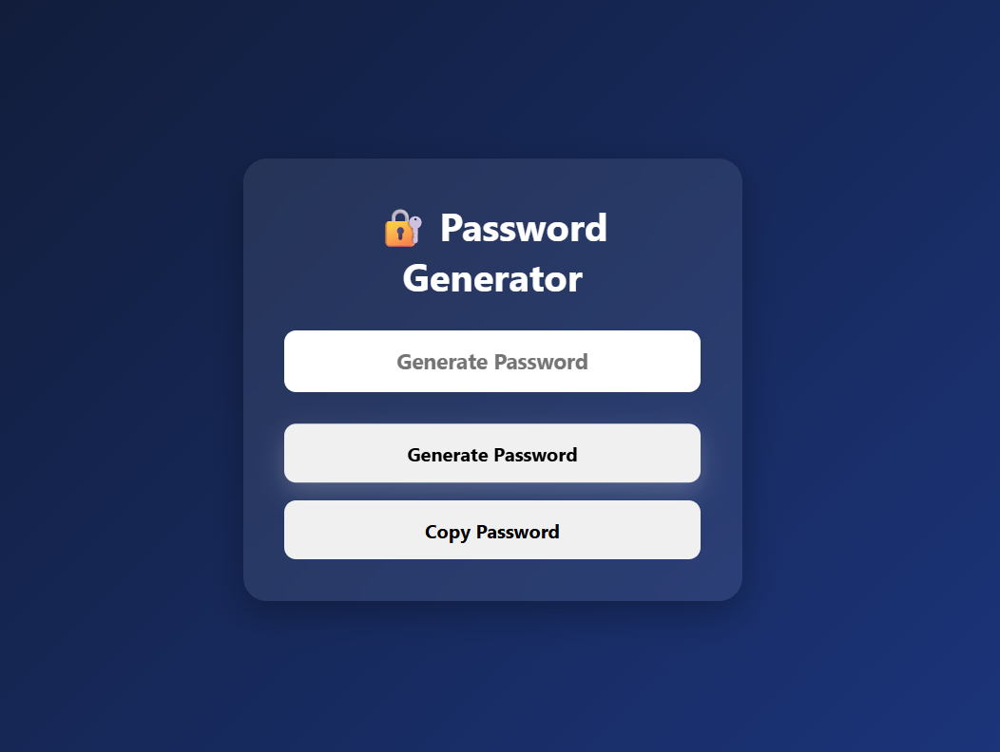

# 🔐 Password Generator

A simple and interactive **Password Generator** built using **HTML, CSS, and JavaScript**. This project generates a strong random password using letters, numbers, and special characters, while also allowing users to copy the generated password with a single click.

## 🚀 Features

* 🔐 Generate a random 12-character password
* 🔄 Generate a new password on every click
* 📋 Copy password to clipboard
* ⚡ Instant password generation
* 🎨 Modern and responsive UI
* 💻 Beginner-friendly project

## 🌐 Live Demo

**🔗 Live Website:** https://day-11-password-generator.vercel.app

## 🛠️ Technologies Used

* HTML5
* CSS3
* JavaScript (ES6)

## 📂 Project Structure

```text
Day-11-Password-Generator
│
├── index.html
├── style.css
├── script.js
└── README.md
```

## 📸 Preview



## 📚 Concepts Practiced

* JavaScript Randomization
* Arrays and String Indexing
* String Methods
* DOM Manipulation
* Event Listeners
* `Math.random()`
* `for` Loop
* Clipboard API

## 🔮 Future Improvements

* 🔢 Custom password length selection
* 🔠 Toggle uppercase and lowercase letters
* 🔣 Include/exclude numbers and symbols
* 👁️ Password strength indicator
* 🌙 Dark/Light mode toggle
* 💾 Save generated passwords using Local Storage

---

### 🚀 Day 11 – 20 Days of JavaScript Projects Challenge

Building one project every day using **HTML, CSS, and JavaScript** to improve my frontend development skills and create a strong portfolio.
