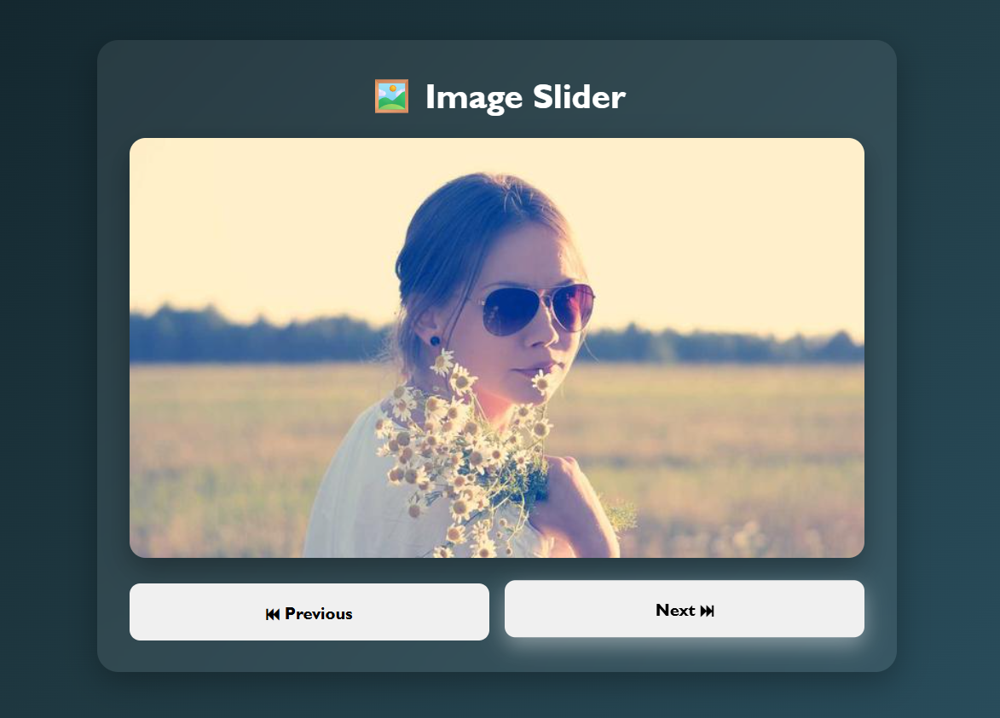

# 🖼️ Image Slider

A simple and interactive **Image Slider** built using **HTML, CSS, and JavaScript**. This project allows users to navigate through multiple images using **Previous** and **Next** buttons while also supporting **automatic image sliding** with the help of JavaScript timers.

## 🚀 Features

* 🖼️ Display multiple images
* ⏮️ Previous image button
* ⏭️ Next image button
* 🔄 Automatic image sliding every 3 seconds
* ⚡ Smooth image transitions
* 🎨 Modern and responsive UI
* 💻 Beginner-friendly project

## 🌐 Live Demo

**🔗 Live Website:** https://day-12-image-slider.vercel.app

## 🛠️ Technologies Used

* HTML5
* CSS3
* JavaScript (ES6)

## 📂 Project Structure

```text
Day-12-Image-Slider
│
├── index.html
├── style.css
├── script.js
└── README.md
```

## 📸 Preview



## 📚 Concepts Practiced

* JavaScript Arrays
* DOM Manipulation
* Event Handling
* `setInterval()` Timer
* Functions
* Array Indexing
* Dynamic Image Rendering

## 🔮 Future Improvements

* ⏸️ Pause and Resume slideshow
* ⏩ Auto-play speed control
* 🎯 Navigation dots indicator
* 📱 Swipe support for mobile devices
* 🌙 Dark/Light mode toggle
* ✨ Smooth fade and slide animations

---

### 🚀 Day 12 – 20 Days of JavaScript Projects Challenge

Building one project every day using **HTML, CSS, and JavaScript** to improve my frontend development skills and create a strong portfolio.
