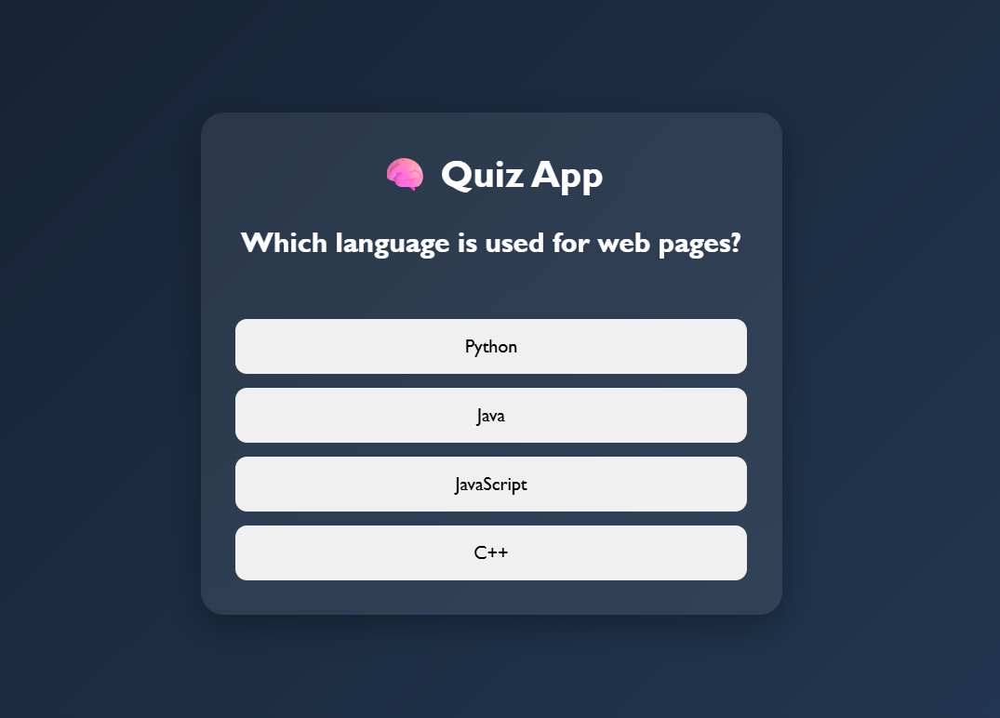

# 🧠 Quiz App

A simple and interactive **Quiz App** built using **HTML, CSS, and JavaScript**. This project presents multiple-choice questions, calculates the user's score, and displays the final result at the end of the quiz.

## 🚀 Features

* 📝 Multiple-choice questions
* 🎯 Score calculation
* ➡️ Next question navigation
* ⚡ Instant answer checking
* 🎨 Modern and responsive UI
* 💻 Beginner-friendly project

## 🌐 Live Demo

**🔗 Live Website:** https://day-13-quiz-app.vercel.app/

## 🛠️ Technologies Used

* HTML5
* CSS3
* JavaScript (ES6)

## 📂 Project Structure

```text
Day-13-Quiz-App
│
├── index.html
├── style.css
├── script.js
└── README.md
```

## 📸 Preview



## 📚 Concepts Practiced

* JavaScript Objects
* JavaScript Arrays
* Score Calculation
* DOM Manipulation
* Event Handling
* Functions
* Conditional Statements
* Dynamic Content Rendering

## 🔮 Future Improvements

* ⏱️ Quiz timer
* 🎨 Answer highlight effects
* 📊 Detailed score summary
* 🔄 Restart quiz option
* 💾 Save high scores using Local Storage
* 📱 Enhanced mobile responsiveness

---

### 🚀 Day 13 – 20 Days of JavaScript Projects Challenge

Building one project every day using **HTML, CSS, and JavaScript** to improve my frontend development skills and create a strong portfolio.
