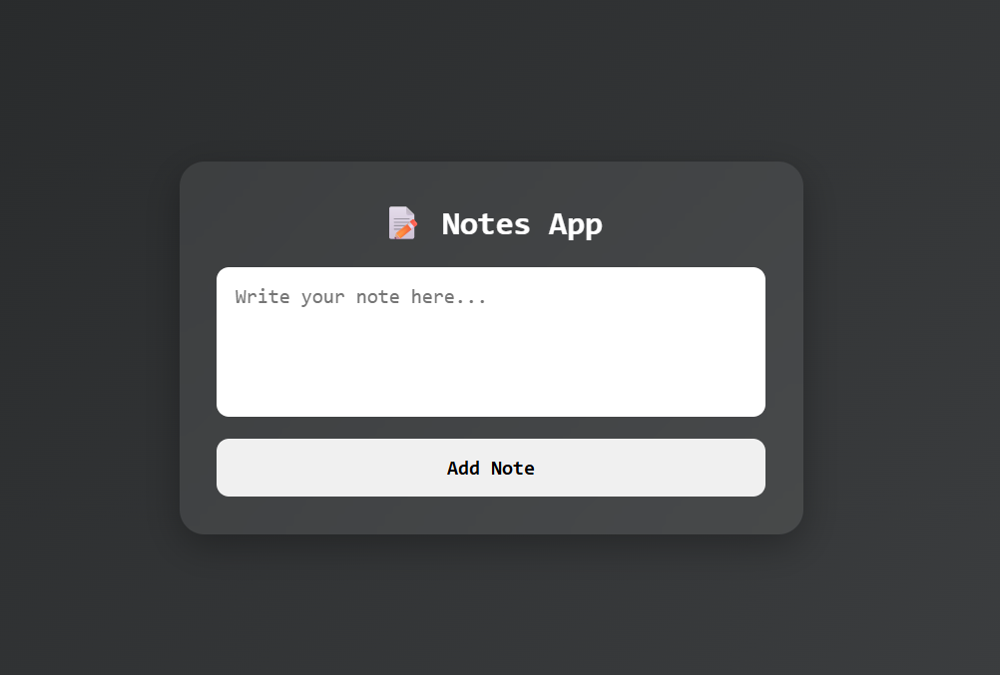

# 📝 Notes App

A simple and interactive **Notes App** built using **HTML, CSS, and JavaScript**. This project allows users to create, view, and delete notes while storing them in the browser using **Local Storage**, ensuring that notes remain available even after refreshing the page.

## 🚀 Features

* 📝 Add new notes
* 👀 View saved notes
* 🗑️ Delete notes instantly
* 💾 Store notes in Local Storage
* 🔄 Data persists after page refresh
* ⚡ Dynamic note rendering
* 🎨 Modern and responsive UI

## 🌐 Live Demo

**🔗 Live Website:** https://day-14-notes-app.vercel.app/

## 🛠️ Technologies Used

* HTML5
* CSS3
* JavaScript (ES6)

## 📂 Project Structure

```text
Day-14-Notes-App
│
├── index.html
├── style.css
├── script.js
└── README.md
```

## 📸 Preview



## 📚 Concepts Practiced

* CRUD Basics (Create, Read, Delete)
* Local Storage
* JavaScript Arrays
* DOM Manipulation
* DOM Rendering
* Event Handling
* Dynamic UI Updates
* JSON Methods (`JSON.stringify()` and `JSON.parse()`)

## 🔮 Future Improvements

* ✏️ Edit existing notes
* 🔍 Search notes functionality
* 📌 Pin important notes
* 🎨 Multiple note colors
* 🌙 Dark/Light mode toggle
* 📱 Enhanced mobile responsiveness

---

### 🚀 Day 14 – 20 Days of JavaScript Projects Challenge

Building one project every day using **HTML, CSS, and JavaScript** to improve my frontend development skills and create a strong portfolio.