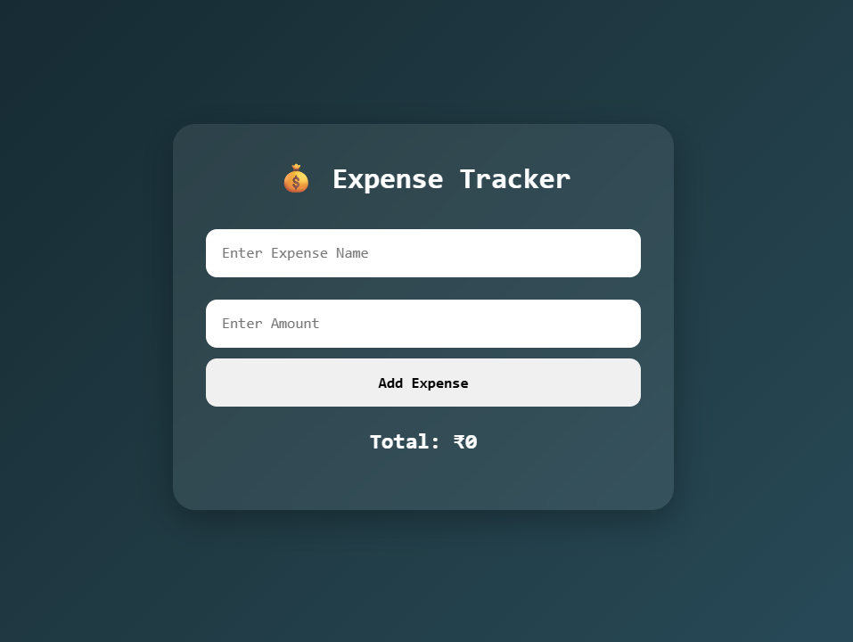

# 💰 Expense Tracker

A simple and interactive **Expense Tracker** built using **HTML, CSS, and JavaScript**. This project allows users to add and delete expenses, automatically calculate the total amount spent, and save all data using **Local Storage** so that expenses remain available even after refreshing the page.

## 🚀 Features

* ➕ Add new expenses
* 🗑️ Delete expenses instantly
* 💰 Automatic total calculation
* 💾 Local Storage support
* 🔄 Data persists after page refresh
* ⚡ Dynamic expense rendering
* 🎨 Modern and responsive UI

## 🌐 Live Demo

**🔗 Live Website:** https://day-15-expense-tracker.vercel.app/

## 🛠️ Technologies Used

* HTML5
* CSS3
* JavaScript (ES6)

## 📂 Project Structure

```text
Day-15-Expense-Tracker
│
├── index.html
├── style.css
├── script.js
└── README.md
```

## 📸 Preview



## 📚 Concepts Practiced

* JavaScript Arrays
* JavaScript Objects
* Calculations
* Local Storage
* DOM Manipulation
* CRUD Operations
* Event Handling
* JSON Methods (`JSON.stringify()` and `JSON.parse()`)
* Dynamic UI Updates

## 🔮 Future Improvements

* ✏️ Edit existing expenses
* 📊 Expense categories
* 📅 Filter expenses by date
* 📈 Monthly expense summary
* 🔍 Search expenses
* 🌙 Dark/Light mode toggle

---

### 🚀 Day 15 – 20 Days of JavaScript Projects Challenge

Building one project every day using **HTML, CSS, and JavaScript** to improve my frontend development skills and create a strong portfolio.

