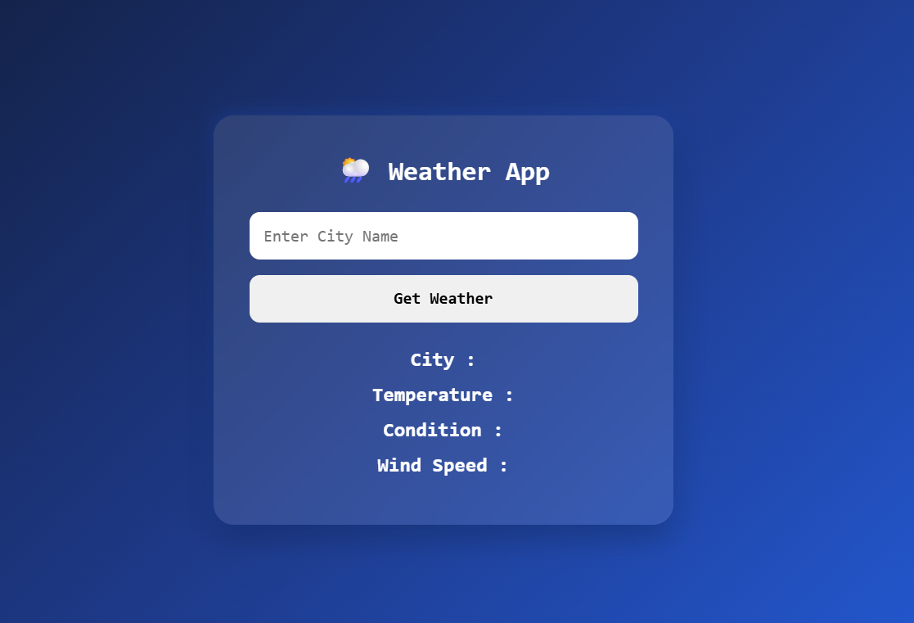

# 🌦️ Weather App

A simple and interactive **Weather App** built using **HTML, CSS, and JavaScript**. This application fetches real-time weather information using the **OpenWeather API** and displays details such as temperature, weather condition, humidity, and wind speed for any city entered by the user.

## 🚀 Features

- 🔍 Search weather by city name
- 🌡️ Real-time temperature display
- ☁️ Weather condition information
- 💧 Humidity details
- 🌬️ Wind speed information
- ⚡ API integration using Fetch API
- 🔄 Asynchronous data handling with Async/Await
- 🎨 Modern and responsive UI

## 🌐 Live Demo

**🔗 Live Website:** https://day-16-weather-app.vercel.app/

## 🛠️ Technologies Used

- HTML5
- CSS3
- JavaScript (ES6)
- OpenWeather API

## 📂 Project Structure

```text
Day-16-Weather-App
│
├── index.html
├── style.css
├── script.js
├── config.example.js
├── .gitignore
└── README.md
```

> **Note:** Create a `config.js` file in the project root and add your OpenWeather API key. This file is ignored by Git using `.gitignore` to keep your API key secure.

## 📸 Preview



## 📚 Concepts Practiced

- APIs
- Fetch API
- Async/Await
- Promises
- JSON Data Handling
- DOM Manipulation
- Event Handling
- Error Handling
- Dynamic Content Rendering

## 🔮 Future Improvements

- 📍 Get weather using current location
- 🌎 Search weather by country
- 📅 5-day weather forecast
- 🌅 Sunrise and sunset information
- 🌙 Dark/Light mode toggle
- 🎨 Weather-based background changes

---

### 🚀 Day 16 – 20 Days of JavaScript Projects Challenge

Building one project every day using **HTML, CSS, and JavaScript** to improve my frontend development skills and create a strong portfolio.
